# Walania Photo Documentation

This folder collects visual snapshots of the Walania interface across the main pages, themes, and screen sizes. It is meant to help track UI changes over time and make it easy to compare how the app behaves on desktop and mobile.

## What Is Included

- `Dashboard`
- `EventManagement`
- `FeedbackForms`
- `Login`
- `RegistrantManagement`

Each folder contains screenshots for light and dark mode, plus desktop and mobile variants where available.

## Dashboard

### Desktop

### Mobile

## Event Management

### Desktop

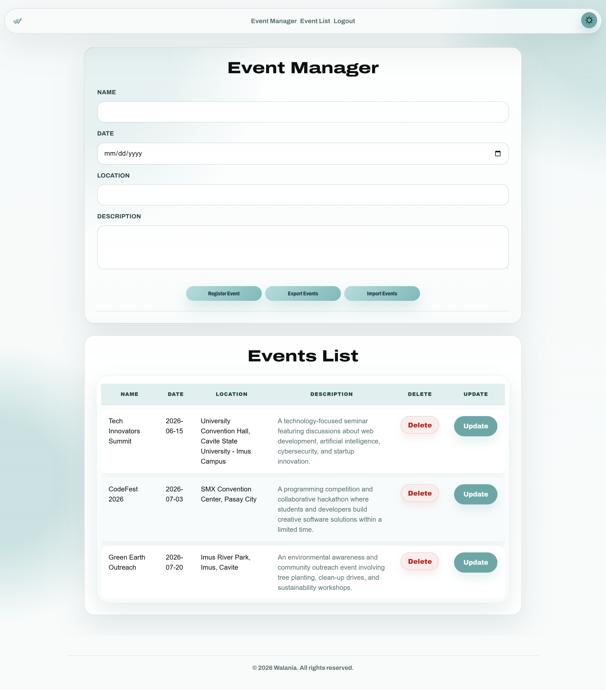

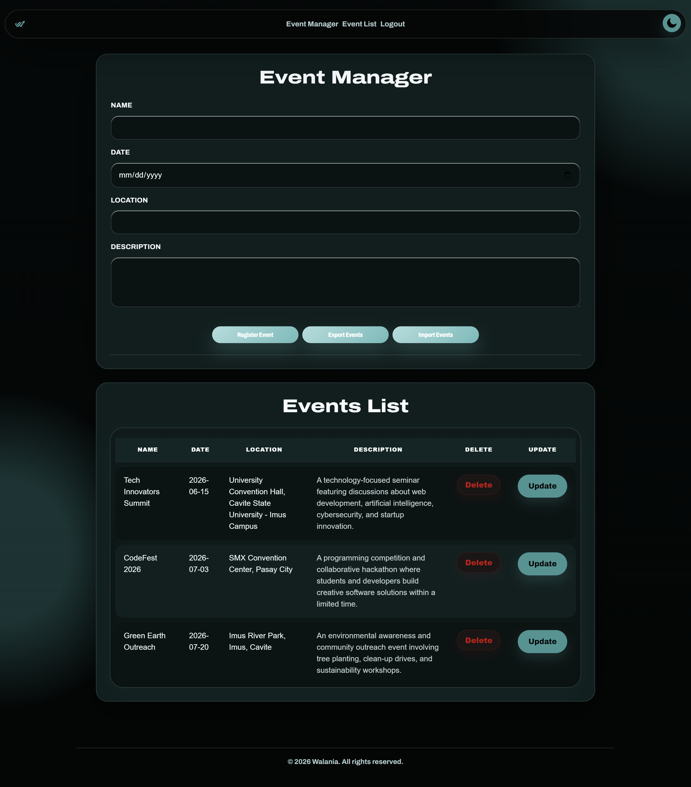

### Mobile

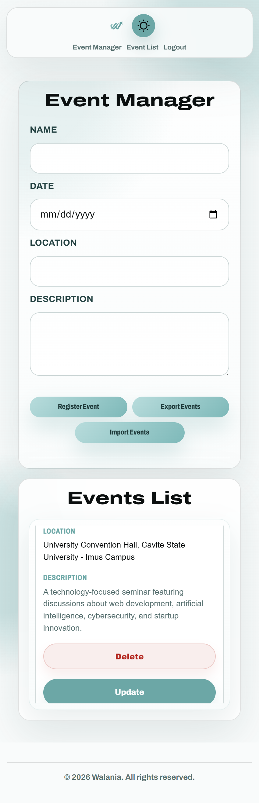

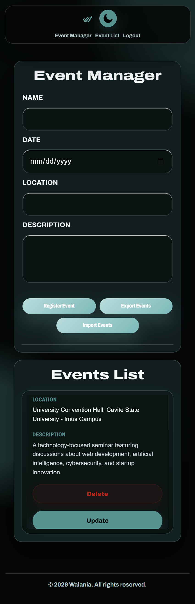

## Feedback Forms

### Desktop

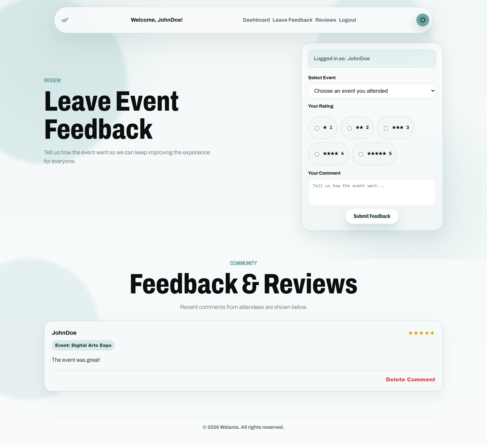

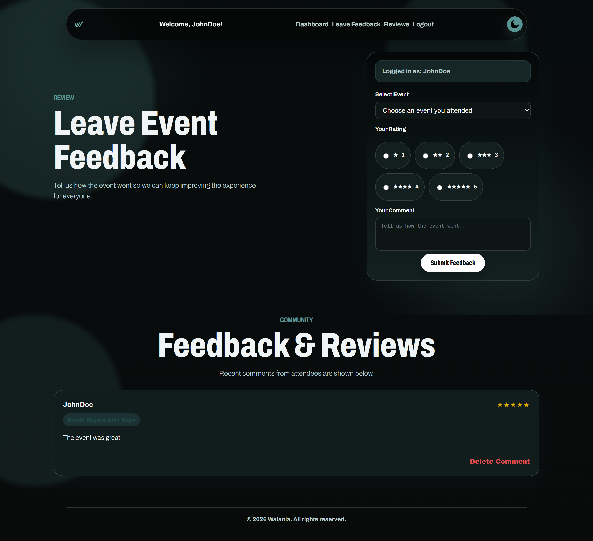

### Mobile

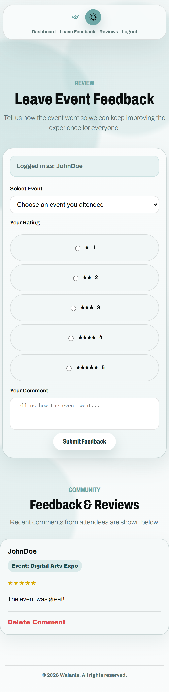

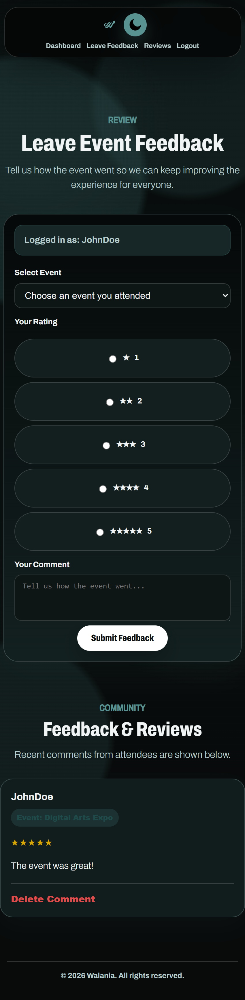

## Login

### Desktop

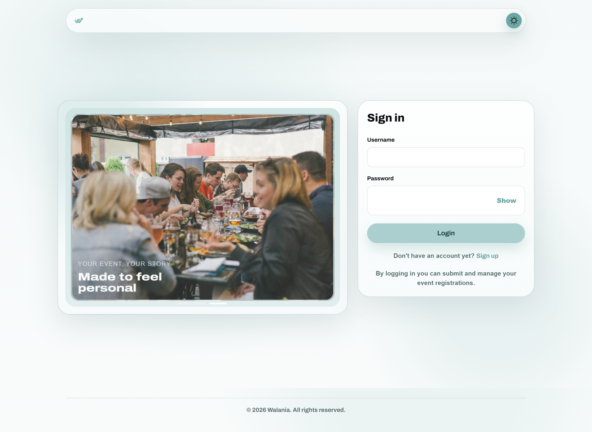

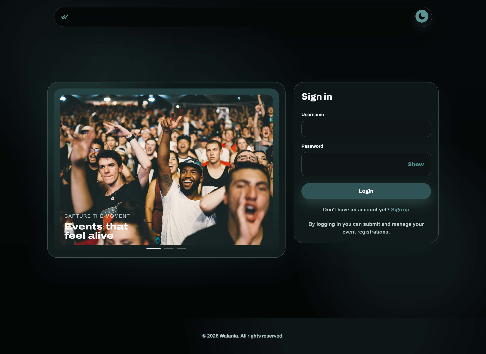

### Mobile

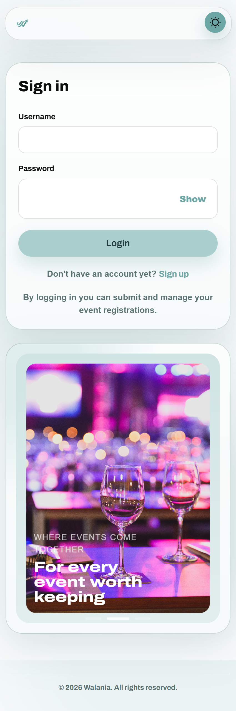

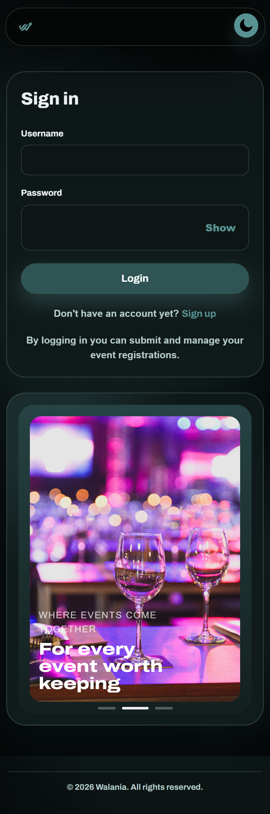

## Registrant Management

### Desktop

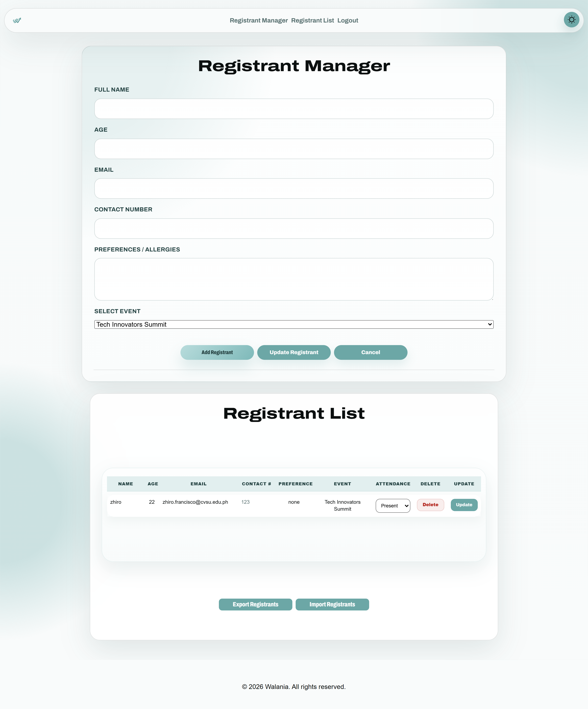

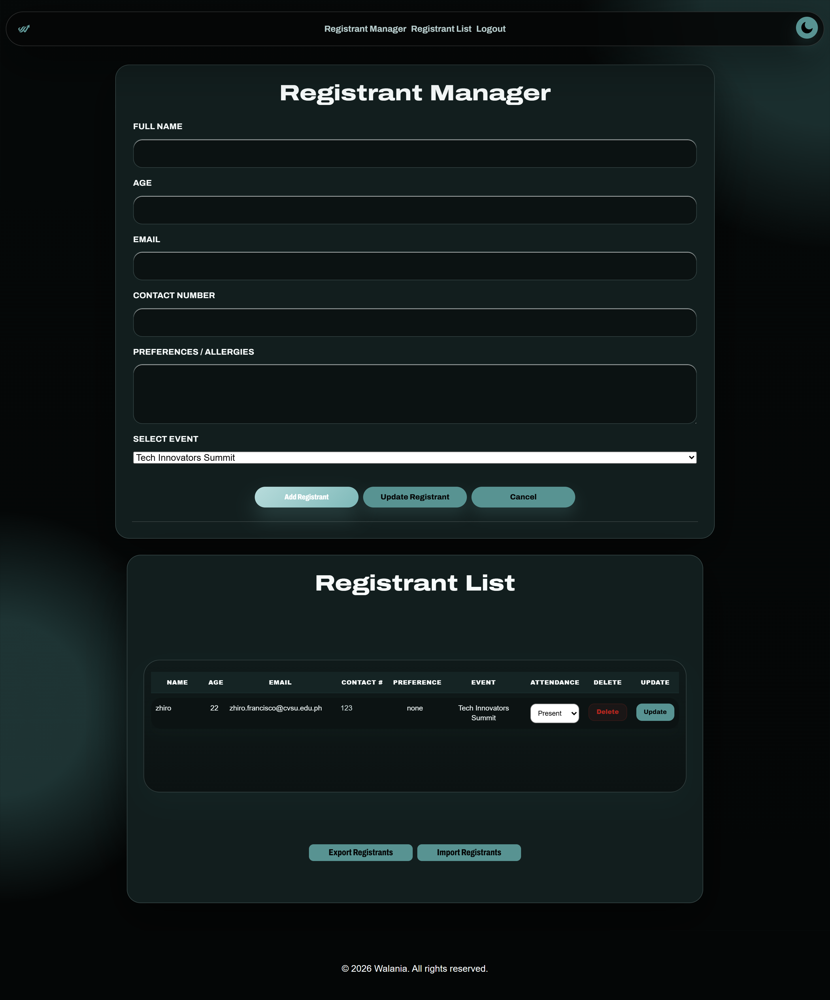

### Mobile

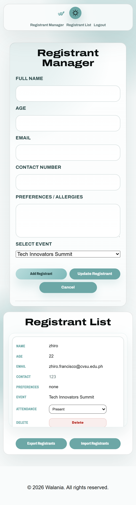

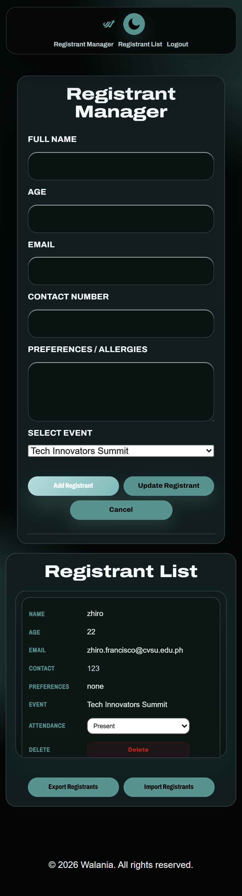

## Notes

- The screenshots are organized by page name, not by route name, to make browsing easier.
- If you add new views later, create a matching folder and follow the same naming pattern:
  - `DesktopLightMode.png`
  - `DesktopDarkMode.png`
  - `MobileLightMode.png`
  - `MobileDarkMode.png`

