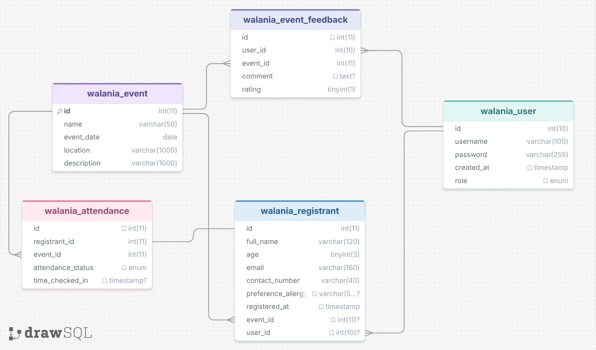

# Walania

Walania is an event management system built to help organizers handle event listings, registrations, attendance, feedback, and admin workflows in one place. It includes a public-facing dashboard, login and registration flows, and management tools for events and registrants.

## What It Does

- Manage event records and updates
- Handle user and admin login
- Register attendees and track attendance
- Collect feedback from participants
- Support event imports and exports
- Provide light and dark mode views across desktop and mobile

## Screenshots

### Login

### Dashboard

### Event Management

### Feedback Forms

### Registrant Management

## ERD

The Entity Relationship Diagram shows how Walania's data is organized across the database. It maps the core relationships between users, events, registrants, attendance, and feedback so the system can store and connect records consistently.

## Project Structure

- `views/` - PHP pages for the app UI
- `controllers/` - request handling and actions
- `models/` - database logic and data models
- `images/` - branding and page assets
- `docs/photo-documentation/` - screenshots and visual documentation

## Setup

1. Place the project inside your local web server directory, such as `htdocs`.
2. Import `walania.sql` into your MySQL database.
3. Update the database connection settings in `models/Database.php` if needed.
4. Open the app in your browser through your local server.

## Members

- Zhyrox - Zhiro, Francisco
- JeremyOrville-ITProg - Batac, Jeremy Orville
- yt1an - Dela Torre, Kristian Elmer
- joshsky-bunny - Bunyad, Alfred Joshua T.

## Notes

- The project is still being improved.
- Background design work, and other visual refinements are planned.
